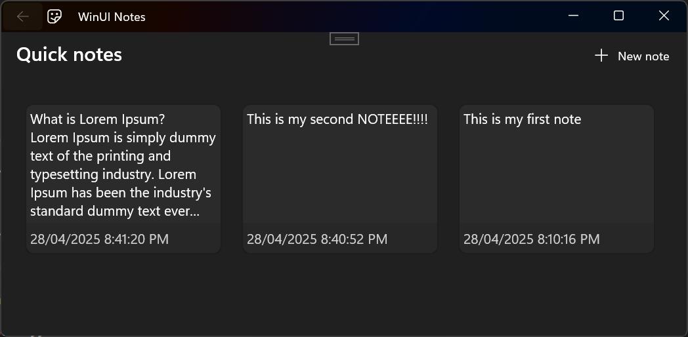

# A notes app written with WinUI 3

Done by completing the tutorial from https://learn.microsoft.com/en-us/windows/apps/tutorials/winui-notes/?tutorial-step=6

# To Do
- Add the app icon
- Add 'Save unsaved changes?' popup when you go back without saving
- Add some kind of visual cue for saved vs unsaved notes (like an asterisk at the title)
- Add 'Are you sure?' popup when you delete a note
- Add keyboard shortcuts: ctrl+S to save. ctrl+Enter to save and close. ctrl+D to delete and close.